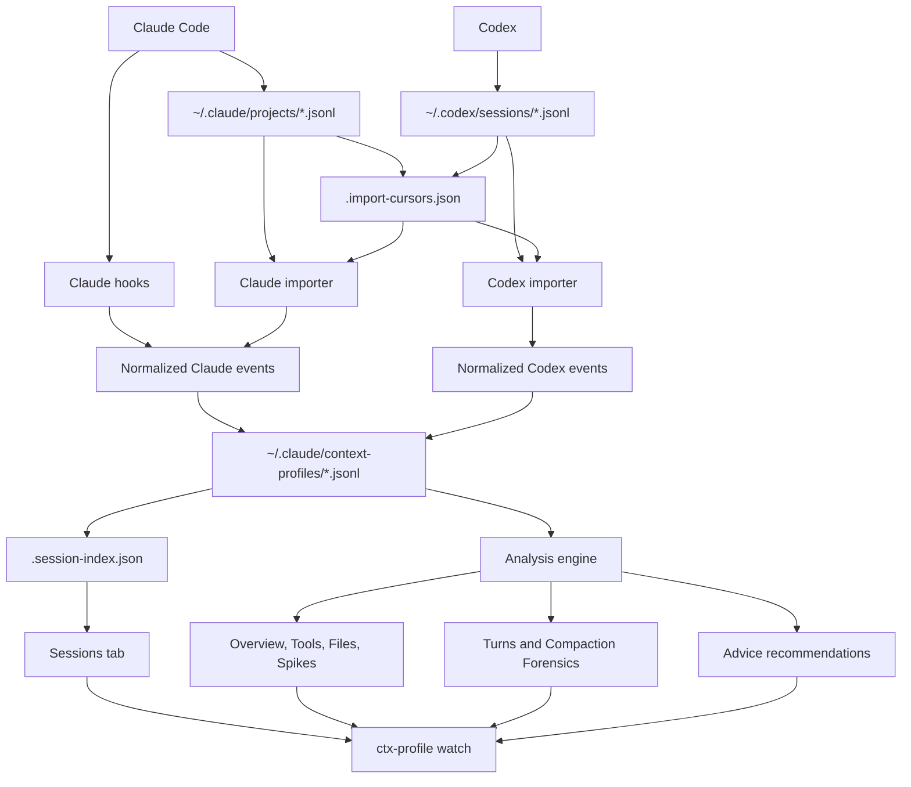

# Context Profiler

Live terminal dashboard for Claude Code and Codex context usage.

It records Claude hook events and imports Codex rollout transcripts into a shared JSONL profile store, then renders a Textual dashboard with context growth, spikes, tool usage, agents, skills, and repeated file reads.

## Quick Install

Clone or download this repository, then run:

```bash
git clone https://github.com/keshrisohit/context-profiler.git
cd context-profiler
bash ./ctx-profiler.sh setup
```

If Textual is missing:

```bash
bash ./ctx-profiler.sh setup --install-textual
```

This installs Textual into a small profiler-managed virtual environment under
the profiler config directory when it is not already available to `python3`.

The setup command is idempotent. It installs:

- Claude hook entries in `~/.claude/settings.json`
- `/context-profiler` command shims for Claude and Codex
- `ctx-profile` terminal shim at `~/.local/bin/ctx-profile` plus `ctx-profiler` compatibility alias
- a Codex plugin copy under `~/.codex/plugins/context-profiler`

## Quick Usage

```bash
ctx-profile status
ctx-profile watch
ctx-profile watch claude
ctx-profile watch codex
ctx-profile watch <custom-source>
ctx-profile watch --source claude --session <id>
ctx-profile latest
ctx-profile latest --session <id>
ctx-profile summary
ctx-profile summary --session <id>
ctx-profile session <id>
ctx-profile top 10 --session <id>
ctx-profile files 10 --session <id>
ctx-profile turns --session <id>
ctx-profile explain --session <id>
ctx-profile clean --days 5 --dry-run
ctx-profile clean --days 5
ctx-profile enable
ctx-profile disable
ctx-profile doctor
```

Run unit tests:

```bash
python3 -m unittest discover -s tests -v
```

Run the live dashboard in a split terminal:

```bash
ctx-profile watch
```

`watch` requires an interactive TTY and refuses to stream the Textual UI through an agent transcript. This keeps the dashboard from dumping terminal control output into Claude/Codex context.

Choose which harness to follow:

```bash
ctx-profile watch claude
ctx-profile watch codex
ctx-profile watch all
```

The default is `all`, which follows whichever Claude or Codex profile was modified most recently.
For another harness, add its source name to `sources` in the config and run `ctx-profile watch <source>`.

Clean old profiler files:

```bash
ctx-profile clean --dry-run
ctx-profile clean
ctx-profile clean --days 5 --dry-run
ctx-profile clean --days 5
```

`clean` uses `cleanup_retention_days` from config when `--days` is not provided. The default is `5`.
The dashboard and CLI also run throttled automatic cleanup for profiler profile
JSONL files by default. Auto-cleanup uses `cleanup_retention_days` and runs at
most once per `auto_cleanup_interval_hours` (default: 24). Raw Codex transcripts
are not deleted automatically; delete them only with `--include-codex-transcripts`.

Large profile files rotate automatically. The first file stays as
`<session>.jsonl`; overflow is written to `<session>.part-0002.jsonl`,
`<session>.part-0003.jsonl`, and so on. The dashboard and CLI still show one
logical session and load all parts in order.

## Consumption Model

Context profiles are for both humans and agents, but they should consume different surfaces.

Humans should use:

```bash
ctx-profile watch
ctx-profile watch claude
ctx-profile watch codex
```

The live Textual dashboard is optimized for human debugging: scanning timelines, comparing tabs, selecting sessions, and spotting context spikes visually.

Agents should use compact command output today:

```bash
ctx-profile explain --session <id>
ctx-profile files 10 --session <id>
ctx-profile turns --session <id>
ctx-profile latest --session <id>
```

Agents should not parse or stream the TUI. Future profiler interfaces should expose stable machine-readable commands, such as:

```bash
ctx-profile explain --session <id> --json
ctx-profile files --session <id> --json
ctx-profile turns --session <id> --json
ctx-profile budget --session <id> --json
```

The target contract for agent consumption is small JSON: current context risk, top expensive files, repeated reads, recent spikes, turn-level contributors, and a recommended next action. An MCP server can later expose the same contract as tools such as `get_context_status`, `get_context_risks`, `get_expensive_files`, and `get_session_turns`.

## Dashboard Basics

TUI tabs:

- `1` Overview
- `2` Timeline
- `3` Tools
- `4` Spikes
- `5` Agents
- `6` Skills
- `7` Files by token impact
- `8` Turns
- `9` Compaction/reset forensics
- `0` Recommendations
- `u` Sessions

The Agents tab shows one row per observed agent run, including source, status,
subagent type, agent/child id, parent session id, timestamps, token cost,
lifecycle operations, and description. It includes agents that are still
requested/running as well as agents that completed earlier. If the selected
Codex session is a child session, the Agents tab also shows the matching parent
session's agent invocation when that relationship is available. If the selected
session has no local or parent agent events, the tab falls back to recent agents
from the selected source so completed Codex agents are still visible instead of
showing an empty table.

The Turns tab shows start time, duration, computed status, tool count, agent
status summary, file summary, top contributor, token growth, and context level.
Press `Enter` on a turn to open the inspector with top agent/file/tool
contributors for that turn.

The Sessions tab is always sorted by session start time, newest at the top. The
global `o` sort key affects analytical tabs, not the Sessions picker.

Useful keys:

- `s` cycle source: all -> Claude -> Codex
- `u` open session selector
- `/` open the Sessions tab and focus session search
- `Esc` leave session search and return focus to the session table
- `Enter` pin the highlighted session in the Sessions tab, or pin the first search match from the search box
- `o` cycle sorting: tokens -> calls -> time -> name
- `m` cycle file grouping: file -> directory -> extension
- `i` toggle ignored profiler/transcript paths in high-usage views
- `a` toggle all sessions for the selected source
- `f` follow timeline tail
- `g` jump timeline top
- `q` quit

When you select a session, the dashboard pins to that session and all views show only events from that session. Toggle `a` to return to all-session aggregation, or cycle source with `s` to clear the pin and follow latest for that source.

The Sessions tab includes a `Role` column:

- `parent:N` means this session spawned `N` child agent sessions.
- `child-><id>` means this session is known as a child of that parent session.
- `-` means no parent/child relationship is known from the captured profile data.

## Usage Guide

Start with one harness:

```bash
ctx-profile watch codex
ctx-profile watch claude
```

Find and pin a session:

1. Press `u` for Sessions.
2. Use arrow keys and `Enter` to pin a visible row.
3. Press `/` and type part of a session id, source, cwd, or modified time to search.
4. Press `Enter` from the search box to pin the first match.
5. Press `Esc` to leave search and return to the session table without changing the filter.
6. All tabs now show only that selected session.

Debug a context jump:

1. Press `8` for Turns to find the expensive user request.
2. Press `4` for Spikes to inspect the largest individual events.
3. Press `7` for Files to see which files consumed the most context.
4. Press `0` for Advice to see recommended workflow changes.

Use sorting and grouping:

- Press `o` to sort by tokens, calls, time, or name.
- Press `m` in Files to group by file, directory, or extension.
- Press `i` to toggle ignored profiler/transcript paths. Default is filtered; raw mode is for audit/debugging.

CLI equivalents:

```bash
ctx-profile explain --source codex --session <id>
ctx-profile turns --source codex --session <id>
ctx-profile files 10 --source codex --session <id>
ctx-profile files 10 --source codex --session <id> --include-ignored
```

Default cleanup retention is configurable:

```json
{
  "auto_cleanup_enabled": true,
  "auto_cleanup_interval_hours": 24,
  "cleanup_retention_days": 5,
  "profile_rotation_enabled": true,
  "profile_max_part_bytes": 10000000,
  "codex_import_limit": 25,
  "claude_import_limit": 25
}
```

`clean` deletes old logical profiles from `~/.claude/context-profiles/` only. If
a profile has rotated parts, cleanup deletes the base and all parts together
only after the newest part is older than the retention window. It does not
delete raw Codex transcripts unless you explicitly pass:

```bash
ctx-profile clean --days 5 --include-codex-transcripts
```

## Flow



`ctx-profile watch` runs as a separate terminal process. It reads profile files from disk and does not consume Claude/Codex model context. It also refuses to run without an interactive TTY, so it will not stream the dashboard into an agent transcript.

## How Advice Works

Advice is generated in `context_profiler/analysis.py` from normalized events:

1. Tool calls are aggregated by tool, file, agent, skill, turn, and spike size.
2. Configured profiler/transcript paths are hidden from high-usage recommendations by default.
3. Recommendations are emitted for repeated expensive file reads, single large tool outputs, large agent returns, multiple spikes, and compaction/reset events.
4. Advice is heuristic. It is meant to identify the biggest actionable context hygiene problems, not to be a perfect token bill.

Ignored paths are still stored and can be viewed with `i` in the TUI or `--include-ignored` in CLI commands.

Codex sessions are imported from:

```text
~/.codex/sessions/**/*.jsonl
```

For Codex Agent lifecycle, the profiler uses transcript evidence:

- `requested`: a `spawn_agent` function call exists but has no output yet.
- `running`: `spawn_agent` returned an `agent_id`.
- `completed`: `wait_agent` returned a completed status for that `agent_id`.

Codex agent events include explicit relationship metadata:

- `parent_session_id`: the main Codex session id
- `child_session_id`: the spawned agent id from `spawn_agent`
- `child_session_ids`: all waited targets for multi-agent `wait_agent`

If a workflow says "spec subagent" in normal text but the transcript has no
`spawn_agent` call, the dashboard will not treat it as a Codex Agent. That is a
stage/role label, not proof that a separate Codex subagent started.

Codex transcripts do not currently emit explicit `Skill` tool calls. The profiler infers Codex skill usage only from direct reads of `.../SKILL.md`, so the Skills tab reflects loaded skill instructions rather than a native Codex skill-call event.

Claude sessions are captured by hooks and written live.
The dashboard also imports recent Claude parent transcripts so Agent requests
show up even before the PostToolUse hook fires. Agent status is intentionally
conservative:

- `requested`: the parent transcript contains an `Agent` tool request.
- `running`: a Claude side transcript exists for that request, but no parent
  result has landed yet.
- `completed`: the parent transcript contains the Agent tool result.

Claude agent events include `parent_session_id` and, when a side transcript is
found, `child_session_id`, `subagent_agent_id`, and `subagent_transcript_path`.

Profiles are stored in:

```text
~/.claude/context-profiles/
```

Large profiles rotate into multiple physical files:

```text
codex-<session>.jsonl
codex-<session>.part-0002.jsonl
codex-<session>.part-0003.jsonl
```

These are treated as one logical session by `ctx-profile watch`, `summary`,
`latest`, `turns`, `files`, and `explain`.

Dashboard performance uses two small cache files beside the profiles:

```text
~/.claude/context-profiles/.session-index.json
~/.claude/context-profiles/.import-cursors.json
```

`.session-index.json` stores lightweight per-session summaries for the Sessions
tab. It is invalidated per session when that session's JSONL part signatures
change. `.import-cursors.json` stores source transcript signatures so unchanged
Claude/Codex transcripts are not reparsed every dashboard refresh. These files
are rebuildable cache/state; deleting them is safe and only makes the next
refresh do more work.

The live dashboard renders the active tab on refresh. Hidden tabs are rendered
when you switch to them, which keeps `ctx-profile watch` responsive without
dropping profile data or imposing row/session limits.

Config is stored in:

```text
~/.claude/context-profiles/config.json
```

`Advice` suppresses known profiler/transcript noise by default through:

```json
{
  "advice_ignore_path_patterns": [
    "*/.codex/sessions/*.jsonl",
    "*/.codex/history.jsonl",
    "*/.claude/context-profiles/*.jsonl",
    "*/.local/bin/ctx-profile*",
    "*/context-profiler/*"
  ]
}
```

By default, high-usage views hide ignored profiler/transcript paths so the profiler does not dominate its own reports. Press `i` in the TUI, or pass `--include-ignored` to CLI commands such as `ctx-profile files`, to inspect raw evidence.

## Slash Command

After setup, use this in Claude or Codex:

```text
/context-profiler status
/context-profiler watch
/context-profiler watch claude
/context-profiler watch codex
/context-profiler watch --session <id>
/context-profiler watch --source claude --session <id>
/context-profiler enable
/context-profiler disable
/context-profiler latest --session <id>
/context-profiler session <id>
/context-profiler files 10 --session <id>
/context-profiler turns --session <id>
/context-profiler explain --session <id>
/context-profiler doctor
```

## Development

Run syntax checks:

```bash
python3 -m py_compile context_profiler_core.py context_profiler/*.py context_profiler/importers/*.py codex-profiler.py visualize.py hooks/*.py
```

Import recent Codex sessions once:

```bash
bash ./ctx-profiler.sh codex-import --limit 5
```

## Architecture

The code is split by responsibility:

- `context_profiler/config.py`: config defaults, enable/disable state, known sources
- `context_profiler/storage.py`: JSONL profile paths, writes, reads, session filtering
- `context_profiler/formatting.py`: display formatting and lightweight token estimation
- `context_profiler/analysis.py`: stats, turns, forensics, recommendations
- `context_profiler/importers/claude.py`: Claude hook payload normalization
- `context_profiler/importers/codex.py`: Codex rollout transcript import
- `context_profiler_core.py`: compatibility facade for existing hooks and scripts

To add another harness:

1. Create `context_profiler/importers/<source>.py`.
2. Convert native logs/hooks into normalized events: `session_start`, `turn_start`, `context_snapshot`, `tool_call`, `compaction`, `session_end`.
3. Persist with `context_profiler.storage.write_profile(session_id, events, "<source>")` or `append_event`.
4. Add the source name to `sources` in `~/.claude/context-profiles/config.json`.
5. Use `ctx-profile watch <source>` or `ctx-profile latest --source <source>`.
